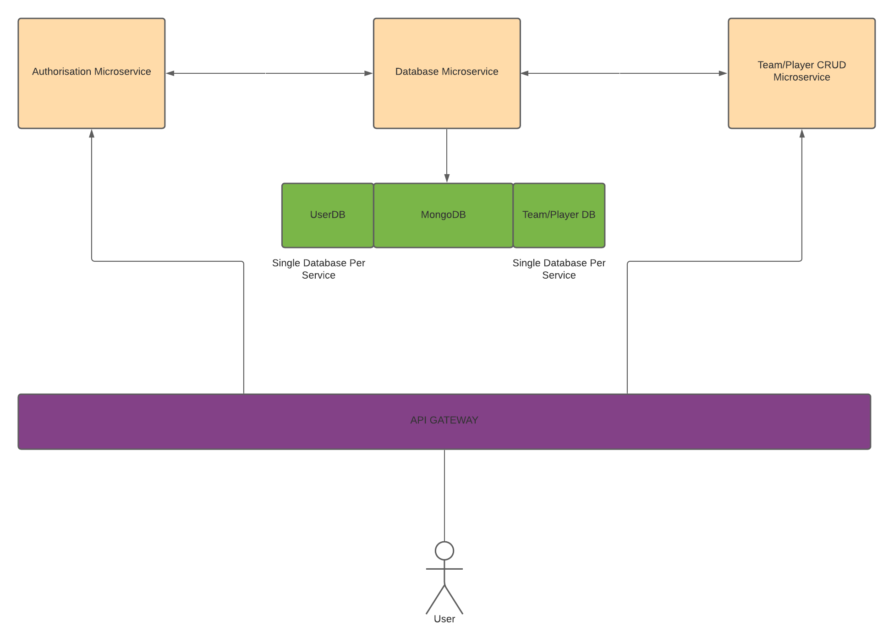

# Cloud-native Microservice Architecture Example

<!-- #### Credit to [Velotio](https://www.velotio.com/engineering-blog/build-a-containerized-microservice-in-golang) for laying the groundwork to build up on -->

## What kind of overall service this application provides:

Developing a cloud-native web application taht works on the following problem statement:

- Competitive Call Of Duty gamers are looking for a platform to recruit teammates to form a competitive team for ranked matches
- The Application should support:
    - Creating a team (max 6 players)
    - Managing team-members

## Architecture:

- - - -
## Authentication/Authorisation Service:

The application has a user-based access control; You can only gain access to the whole app if you've registered. The service authenticates the user and either returns **200** or **401** for authorised vs unauthorised users respectively.

- - - -
## Database Service: 

The databases will store team details aswell as all player details. UserDB to store all registered users. Following the [Single Database Per Service](https://microservices.io/patterns/data/database-per-service.html).

- - - -

## Team/Player CRUD Service:

This service is self documenting as it's a simple CRUD menu on both Player and Teams.

- - - -

## Project Layout:

- **api**: Stores the proto and pb files for the gRPC protobuf interface.
- **cmd**: Entry point [main.go]
- **deploy**: All deployment files when being deployed to aws.
- **config**: Conrfiguration files/variables to be consumed in the application.

